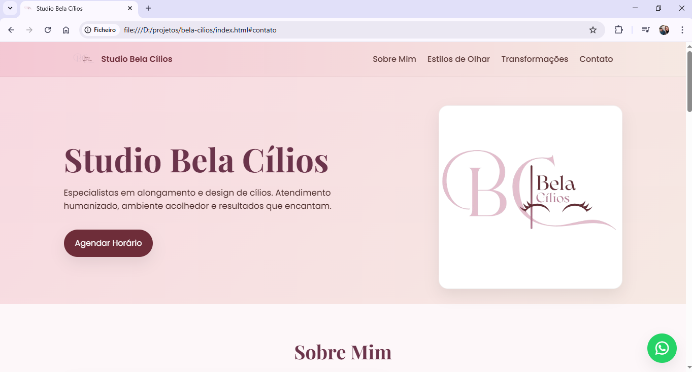

# 💖 Studio Bela Cílios

Site profissional desenvolvido para o **Studio Bela Cílios**, especializado em alongamento e design de cílios.
Projeto criado para praticar **HTML**, **CSS** e **JavaScript**, com foco em visual moderno, elegante e responsivo.


## 🌐 Descrição

Este site apresenta de forma clara e visualmente atraente:

* Seção *Sobre Mim* apresentando a profissional
* Tipos de alongamento com fotos explicativas
* Galeria com transformações reais
* Informações de contato e horários
* Botões de agendamento via WhatsApp
* Mapa incorporado
* Navegação responsiva com menu hambúrguer

Tudo projetado para transmitir profissionalismo, delicadeza e confiança.


## 💻 Tecnologias Utilizadas


## 🔗 Link do Repositório

[GitHub - Bela Cílios](https://github.com/Gleicekeli12/bela-cilios)

## 📂 Estrutura do Projeto

```
/
|-- index.html
|-- styles.css
|-- script.js
|-- /img
     |-- logo-bela.png
     |-- favicon.png
     |-- ana-clara.jpeg
     |-- classico.jpg
     |-- hibrido.jpg
     |-- volume-russo.jpg
     |-- mega-volume.jpg
     |-- cilios-1.jpg ...
```


## 🚀 Como Rodar Localmente

1. Clone o repositório:

```bash
git clone https://github.com/SEU-USUARIO/studio-bela-cilios.git
```

2. Acesse a pasta do projeto:

```bash
cd studio-bela-cilios
```

3. Abra o arquivo `index.html` no navegador.

> 💡 Dica: Para uma experiência melhor no desenvolvimento, use a extensão **Live Server** do VS Code.


## 🖼️ Prévia do Projeto





## 🙋‍♀️ Desenvolvedora

Feito com 💙 por **Gleice Keli**


<a href="https://www.linkedin.com/in/gleice-keli-felipe9670/">LinkedIn – Gleice Keli Felipe</a>

